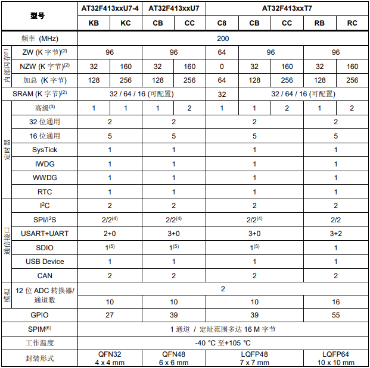

# [AT32F413](https://github.com/SoCXin/AT32F413)

* [arterytek](https://www.arterytek.com/cn/index.jsp): [Cortex-M4](https://github.com/SoCXin/Cortex)
* [L5R4](https://github.com/SoCXin/Level): 200 MHz x 1.25 DMIPS/MHz

## [简介](https://github.com/SoCXin/AT32F413/wiki)

### 关键特性

* Cortex®-M4主频最高 200 MHz
* 高达 16MB 外部 SPI Flash memory 扩展
* 3 x USART + 2 x UART
* 2 x CAN 2.0B
* Crystal-less USB2.0
* SDIO

### [资源收录](https://github.com/SoCXin/AT32F413)

* [参考资源](src/)
* [参考文档](docs/)
* [参考工程](project/)

### [选型建议](https://github.com/SoCXin)

[AT32F413](https://github.com/SoCXin/AT32F413)

#### 封装规格

* LQFP64 10 x 10 mm
* LQFP48 7 x 7 mm
* QFN48 6 x 6 mm
* QFN32 4 x 4 mm

### [探索芯世界 www.SoC.xin](http://www.SoC.Xin)
