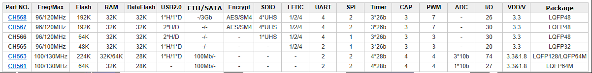

# [CH56x单片机](https://github.com/sochub/CH56)
 
####  qitas@qitas.cn
#### 父级：[WCH](https://github.com/sochub/WCH) 
#### 归属：[RISC](https://github.com/sochub/RISC) 
### [描述](https://github.com/sochub/CH56/wiki) 

CH56x系列是WCH 32位高性能型高速接口系列MCU，该系列运行频率可以在120MHz左右，包括的主要特殊功能有：USB / Ethernet / SATA / SDIO

该系列的特点就是非常见的的数据通信接口，可扩展的存储介质接口，适合用于USB转存储设备。

 

### [收录产品](https://github.com/sochub/CH56)

- [CH568](https://github.com/sochub/CH568) 
- [CH567](https://github.com/sochub/CH567) 
- [CH563](https://github.com/sochub/CH563) 
- [CH561](https://github.com/sochub/CH561) 

### [WCH产品](https://github.com/sochub/WCH)

- [CH57x无线系列](https://github.com/sochub/CH57)
- [CH55x USB系列](https://github.com/sochub/CH55)
- [CH54x触控系列](https://github.com/sochub/CH54)

###  [SoC开发平台](http://www.qitas.cn)   
