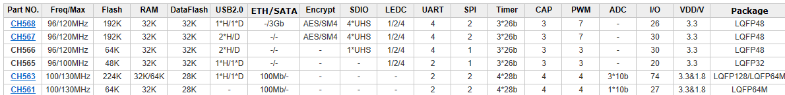
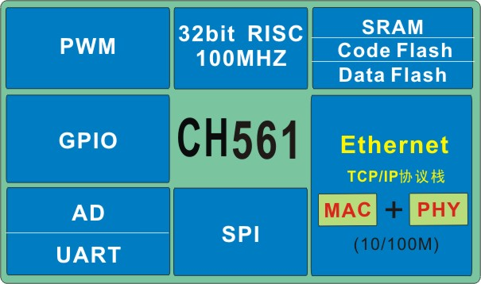

# [CH561](https://github.com/sochub/CH561) 

 

#### [Vendor](https://github.com/sochub/Vendor)：[WCH](https://github.com/sochub/WCH)
#### [Cortex](https://github.com/sochub/Cortex)：[E8051](https://github.com/sochub/8051)
#### [Level](https://github.com/sochub/Level)：100/130MHz 

### [简介](https://github.com/sochub/CH56/wiki) 

[CH561](https://github.com/sochub/CH561) 是一款32位RISC精简指令集CPU，默认系统主频为100MHZ, 64K FLASH、28K DATAFLASH、32K SRAM, 片上集成支持10/100M自适应的网络接口（MAC + PHY），内置网络PHY，LQFP64M，可广泛应用于各种联网控制类应用。

 

 

- [CH568](https://github.com/sochub/CH568) 
- [CH567](https://github.com/sochub/CH567) 
- [CH563](https://github.com/sochub/CH563) 
- [CH561](https://github.com/sochub/CH561) 

### [资源收录](https://github.com/sochub/CH561)

- [文档](docs/)
- [资源](src/)

### [选型建议](https://github.com/sochub)

[CH561](https://github.com/sochub/CH561) 是该系列低规格配置，升级版本[CH563](https://github.com/sochub/CH563)拥有更多存储和IO

##  [SoC开发平台](http://www.qitas.cn)  

